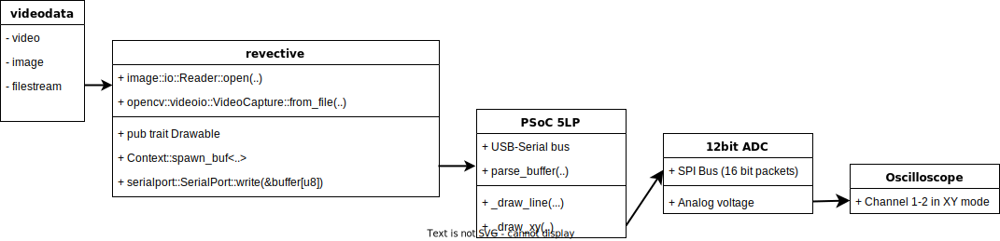

# revective
Welcome to **revective!** the software penchant of my XY plotter.
See the xigrek repo for the hardware penchat. This software is meant to drive a 12-bit ADC via a Cypress PSoC 5LP microcontroller. Many of the code's structures count on this basic knowledge.

## Overview

The image above explains revective's position in the chain of software that drives the XY plotter. 
The current iteration of the program acts as a bridge between common video formats and the microcontroller. 
The objective is to cut the job of the microcontroller by turning these files into easily digestible bytes for the ADC.

### How it works
revective turns images into black-and-white bitmaps, finds the edges, and converts each pixel into a 32bit value representing it's position if and only if it's not black.
Files are loaded via their library-specific method (opencv::videoio for video and image::io:Reader for images) with the convention that the upper left corner is the (0,0) coordinate.
Images are then turned into their bitwise buffer equivalent and processed before being sent to the Serialport in bloc. 

Bitwise, a single point is represented in memory as follow
  

    
  

The 8bit flag is used for basic one-way signaling between the computer and the microcontroller. 
The flag byte can be used to signal a point (`0x80u`), clearing the microcontroller's buffer (`0x10u`), a line (`0x40u`), or an unbuffered coordinate (`0x8u`).
Flags can be combined in ways that make sense (e.g no point+line flag) but that remains untested. More importantly the flag byte also enables the switch to shortmode with the value `0x7fu`.

Shortmode enables a **modest pts/s speedgain** by halving the size of the packet to 16bits/point. Instead of sending direct coordinates like in longmode, revective sends dx and dy values. The microcontroller is responsible for keeping the total coord. of both x and y in memory.
Shortmode is entered by provinding two things, a `0x7fu` flag in the flag byte and an anchor point in the following x-y coordinates bits. The microcontroller will save those coordinates and add the values (from -126 to 126) received in shortmode. Bitwise, the representation is as follow:
  

    
  

Because the microcontroller always reads data from serial in packets of *at least* 4 bytes, we can expect it to see at least one point in the future in shortmode. As such, to leave shortmode we can issue 4 consequtive `0x7fu` bytes.
This last point is important. To maintain maximimal speed between block transfers, it's important to align the buffers sent to multipliers of 4 bytes.

## Example

## Autres
Thanks for visiting this page ^-^. This project wasn't really meant to be shared but feel free to DM me here if you have more questions or want to implement this yourself!! 

